# barsPlus

Add another "dimension" to your dashboard with *transitions*.  Transitions show the user how the data changes with different selections. Chart elements will slowly morph into new chart, giving the user extra information about how the selections have affected the chart.

barsPlus is a single extension that allows creating bar charts (horizontal and vertical), stacked bar charts, 100% stacked bar charts, stacked bars showing changes, and area charts.

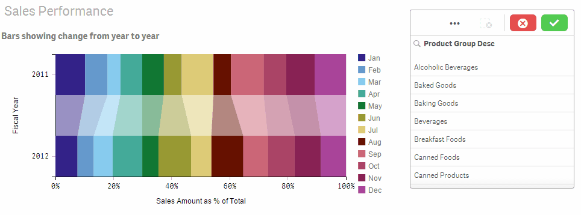

# Features

* regular and stacked bar charts

  * Regular bar chart: zero dimensions and multiple measures, or one dimension and one measure.

  * Stacked bar chart: one dimension and multiple measures, or two dimensions and one measure.

* stacked bars can be normalized (100% bars for percent contribution)
* horizontal or vertical bars
* area charts (standard or 100%)
* transitions
* bar connectors (skewed blocks between bar segments showing change)
* legends
* tooltips
* standard and quick selections
* multiple options available for fine tuning appearance
* text inside bars: number, dimension text, or percentage (100% bars)
* bar total lables: number, dimension text
* fully flexible colors, expressions can be used to determine colors and support persistent colors

# Installation

1. Download the extension zip, `qlik-barplus-chart_<version>.zip`, from the latest release(https://github.com/qlik-oss/barsPlus/releases/latest)
2. Install the extension:

   a. **Qlik Sense Desktop**: unzip to a directory under [My Documents]/Qlik/Sense/Extensions.

   b. **Qlik Sense Server**: import the zip file in the QMC.

# Developing the extension

If you want to do code changes to the extension follow these simple steps to get going.

1. Get Qlik Sense Desktop
1. Create a new app and add the extension to a sheet.
2. Clone the repository
3. Run `npm install`
4. Set the environment variable `BUILD_PATH` to your extensions directory. It will be something like `C:/Users/<user>/Documents/Qlik/Sense/Extensions/<extension_name>`.
5. You now have two options. Either run the watch task or the build task. They are explained below. Both of them default to development mode but can be run in production by setting `NODE_ENV=production` before running the npm task.

   a. **Watch**: `npm run watch`. This will start a watcher which will rebuild the extension and output all needed files to the `buildFolder` for each code change you make. See your changes directly in your Qlik Sense app.

   b. **Build**: `npm run build`. If you want to build the extension package. The output zip-file can be found in the `buildFolder`.

# Chart Examples

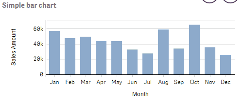
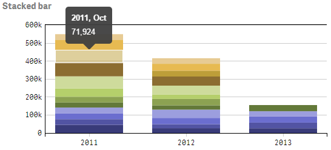
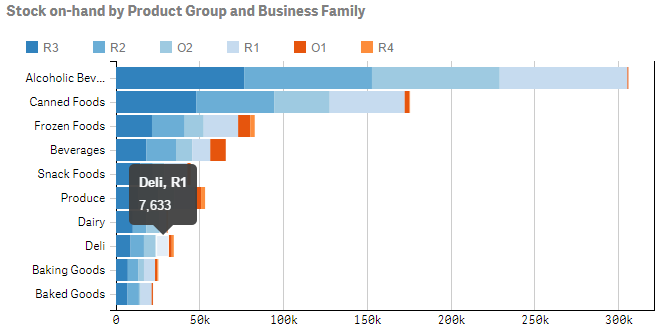
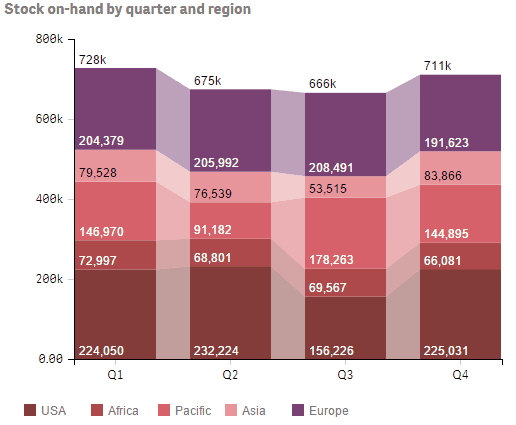
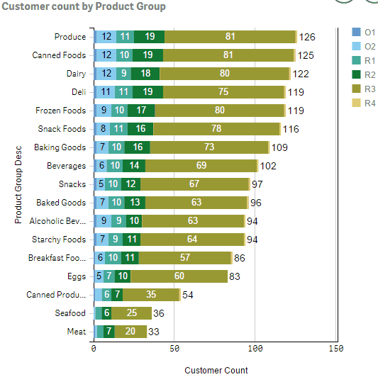
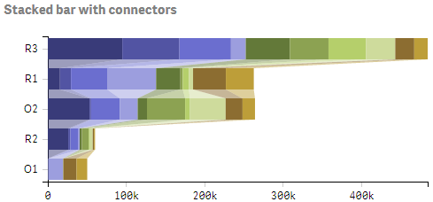
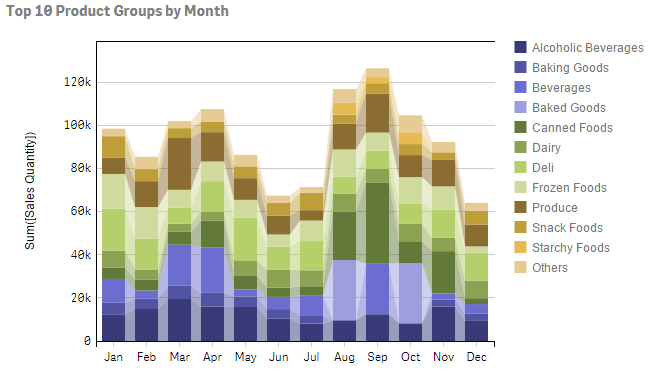
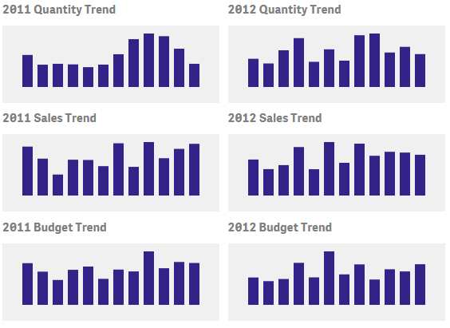

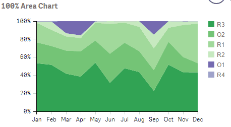

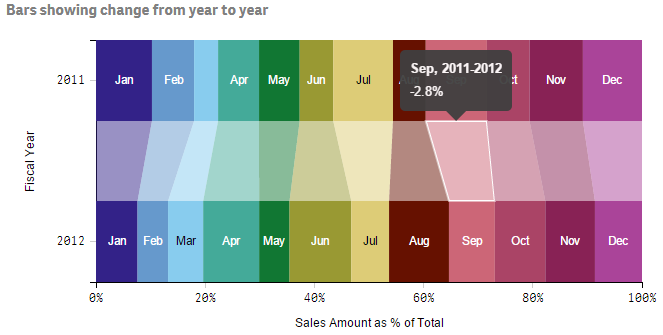

# Usage

## Basic chart with defaults

1.  Drag the extension to a Qlik Sense sheet.
2.  Usually add one dimension and one measure for a simple bar chart or two dimensions and one measure for stacked bar charts. The label for the first dimension becomes the dimension axis title and the label for the measure becomes the measure axis title.
3.  You may also omit the dimension and add just measures for a simple bar chart, each measure is associated with one bar.  The titles for both axes must be specified since they can't be inferred from the selections.  Alternately you can specify a single dimension and multiple measures for a stacked bar chart.  This requires specifying the measure axis title.
4.  Make sure the dimension settings in the properties panel have *Show null values* unchecked.
5.  **Important:** set the sort order, sort by dimensions first, measures last.
    * to create a stacked bar chart which is ordered by the measure value, set the sort order for the primary dimension to be an expression, e.g. =SUM(Measure), ascending or descending.
6.  Generally you should exclude zero values for the measure by clearing the checkbox "Add-ons" -> "Data Handling" -> "show zero values"

## Quick Start for Various Chart Types

**Simple bar** - one dimension and one measure, or zero dimensions and multiple measures

**Stacked bar** - one dimension and multiple measures, or two dimensions and one measure - axis dimension comes first, sort dimensions first

**100% stacked bar** - one dimension and multiple measures, or two dimensions and one measure - axis dimension comes first, sort dimensions first
* Appearance -> Presentation -> 100% Bars = on
* Appearance -> Presentation -> Grid height relative to max bar = 1

**100% stacked bar showing connectors** - one dimension and multiple measures, or two dimensions and one measure - axis dimension comes first, sort dimensions first
* Appearance -> Presentation -> 100% Bars = on
* Appearance -> Presentation -> Bars with connectors = on
* Appearance -> Presentation -> Grid height relative to max bar = 1
* Appearance -> Presentation -> Bar spacing = 0.5
* Appearance -> Presentation -> Outer Bar spacing = 0

**Area chart** - one dimension and multiple measures, or two dimensions and one measure - axis dimension comes first, sort dimensions first
* Appearance -> Presentation -> Bars with connectors = on
* Appearance -> Presentation -> Bar spacing = 1
* Appearance -> Presentation -> Outer Bar spacing = 0

**100% Area chart** - one dimension and multiple measures, or two dimensions and one measure - axis dimension comes first, sort dimensions first
* Appearance -> Presentation -> 100% Bars = on
* Appearance -> Presentation -> Bars with connectors = on
* Appearance -> Presentation -> Bar spacing = 1
* Appearance -> Presentation -> Outer Bar spacing = 0
* Appearance -> Presentation -> Grid height relative to max bar = 1

## Property Panel

### Add-ons -> Selection mode

* You can set the selection mode in "Add-ons" -> "Selection mode"

  * **Standard**: this is the default Qlik Sense selection mode where you can preview multiple selections.

  * **Quick**: this is similar to QlikView classic selection mode where the selection is immediately applied.

### Appearance -> Presentation

* **Orientation**: change the bar format: horizontal or vertical

* **100% bar chart**: choose *100% bars* to make the stacked bars all the same height with the segments within each bar representing a portion of the total (like a pie-chart in bar format).  When this is selected, you should also set *Grid height relative to max bar* to 1.

* **Bars with connectors**: connectors are the skewed blocks that join segments in adjacent bars in a stacked bar chart.  These give an indication of how the segments change.  The connectors also have tooltips to show the numerical value of the change.

* **Bar spacing**: this controls the gap between bars. A value of 0 (no gap) is appropriate for a histogram, while a value of 1 is used to create an area chart.

* **Outer bar spacing** is the spacing before the first bar and after the last bar.  Set this to 0 to remove all spacing.

* **Grid height relative to max bar** generally the highest bar in a bar chart does not touch the top of the chart, so the grid is bigger than the highest bar.  Set this number to a value greater than one to provide space between the highest bar and the top of the chart.  Set this to 1 to allow bars to touch the top.  This should be set to 1 for 100% charts.

* **Background color** you can set the background color for the grid by entering a single color.  This can be a javascript color name: (white, gray, azure), a hex code (e.g. #d0d0d0, #f8f8f8), or rgb specifier: rgb(230,250,250).

### Appearance -> Colors and Legend

* **Color source**: can be either *assigned* or *calculated*.  Assigned colors are taken sequentially from a color scheme.  Calculated colors allow a Qlik Sense formula to be used to return either the offset of a color in the color scheme, or a color value.
See the description *Assigning Colors* below.

* **Color attribute**: if the color source is *calculated*, you may specify what the formula returns -- an offset into the color scheme or a color value.
See the description *Assigning Colors* below.

* **Color scheme**: select one of the predefined color schemes.  Unless an offset is specified (see below), the colors are assigned sequentially starting at the beginning.

  * *category10*, *category20*, *category20b*, *category20c*: standard D3 color schemes

  * *google20*: bright color scheme

  * *custom100*: lifted from Qlik Sense theme file

  * *qlikView18*: QlikView classic colors

  * *qlikSense12*: Qlik Sense default colors

* **Start offset in color scheme**.  In order to specify a different starting color in the color scheme, enter a number here from 0 to (number of colors) - 1.  The number of colors in a color scheme is shown in the name of the color scheme, e.g. category10 has 10 colors so the offset can be from 0 to 9.  Note that when necessary the colors are reused in a revolving fashion.

* **Show legend** indicates whether a legend is to be shown.

* **Legend position** specifies the position of the legend: *Right*, *Left*, *Top*, or *Bottom*.

* **Legend size** allows you to adjust the size (width for right/left legends or height for top/bottom legends).  Choose *Narrow*, *Medium* or *Wide*.

* **Legend spacing** is only applicable to top or bottom legends and it controls spacing between the individual legend items.  Choose *Narrow*, *Medium* or *Wide*.

#### Appearance -> X-Axis

*Note that the x-axis may be either the dimension or the measure axis, depending on the chart orientation.  Information here describes the dimension axis*

* **Labels and title** whether to show *Labels and title*, *Labels only*, *Title only*, or *None*.  Title is the single name for an axis appearing in the center.  Labels are the ticks, numbers/descriptions, gridlines.

* **Dimension axis title**: the dimension axis title is usually taken from the label of the first dimension defined, so this field is hidden.  If there are no dimensions and multiple measures, you can enter the title for the axis here.

* **Label Style:** *Auto*, *Horizontal*, *Staggered*, *Tilted*.  Auto means a horizontal label will be used unless there is not enough space, in which case the labels will be tilted 45 degrees.

* **Gridlines** controls whether gridlines can span the length or height of the chart.  Gridlines cannot be shown when labels have been suppressed.

* **Dimension margin size** refers to the width/height of the labels and axis excluding the axis title.  Select *Narrow*, *Medium* or *Wide*.

### Appearance -> Y-Axis

*Note that the y-axis may be either the dimension or the measure axis, depending on the chart orientation.  Information here describes the measure axis*

* **Labels and title** whether to show *Labels and title*, *Labels only*, *Title only*, or *None*.  Title is the single name for an axis appearing in the center.  Labels are the ticks, numbers/descriptions, gridlines.

* **Measure axis title**: if only one measure is specified, the measure axis title is taken from the label of the measure.  If multiple measures are defined, you can enter the title for the axis here.

* **Label Style:**: *Auto*, *Horizontal*, *Staggered*, *Tilted*.  Auto means a horizontal label will be used unless there is not enough space, in which case the labels will be tilted 45 degrees.

* **Gridlines** controls whether gridlines can span the length or height of the chart.  Gridlines cannot be shown when labels have been suppressed.

* **Measure margin size** refers to the width/height of the labels and axis excluding the axis title.  Select *Narrow*, *Medium* or *Wide*.

* **Measure tick spacing** controls the number of ticks that appear on the axis.  Wide has few ticks while Narrow has more.  Choose *Wide*, *Medium*, or *Narrow*.

* **Measure axis number format**: since it's not clear how to format numbers using Qlik Sense format strings from an extension, the native D3 number formatting is used on the measure axis. Choose the basic format from the dropdown or specify *Custom* to enter a D3 format string.  Format strings are described here:
*[D3 Format Description](https://github.com/d3/d3-3.x-api-reference/blob/master/Formatting.md "D3 format strings")*

### Appearance -> Text on Bars

* **Text on bars**

  * *None* for no text on bars

  * *Inside bars* to display text in each segment that makes up a stacked bar,

  * *Total* to display text on top of each vertical bar or to the right of each horizontal bar,

  * *Both* to display both the text inside the bars and the total text

* **Text to show in bars**: choose whether to show the *Measure* number, the *Dimension* text, or in the case of 100% bars *Percent*

* **Text to show for total** allows either the total number to be displayed (*Measure*) or the *Dimension* text (allowing the dimension axis labels to be removed).

* **Horizontal inner bar padding (px)** sets the amount of space to the left and right of text inside a bar.

* **Vertical inner bar padding (px)** specifies the amount of space above or below text inside a bar.

* **Text size proportional**: select this to have the text change in size when the chart is resized.  This requires adjustment of the text size proportion factor.

* **Text size proportion factor** is the size of the text relative to the width of bars (for vertical bars) or the height of the bars (for horizontal bars).  For horizontal bars this is set to 1 to make very large text, for vertical bars the factor is usually much less.  Some experimentation is needed to get the correct factor.  This parameter is shown only when *Text size proportional* is *Proportional*.

* **Max text size (px)** can be set when the text size is proportional to bar size.  This sets a limit on how big the text can be.  This parameter is shown only when *Text size proportional* is *Proportional*.

* **Text size (px)** sets the size of the text in pixels.  This parameter is shown only when *Text size proportional* is *Not proportional*.

* **Show text at all if ellipsis**: text that is too long to fit in the space provided is shortened and an ellipsis "..." is added to indicate not all the text is displayed.  For numbers this can cause invalid information to be displayed so it is better not to show any text at all if the ellipsis is present.

* **Text color** *Auto* will cause the color to change depending on the bar color in order to increase the contrast, but this can be overridden to make the text always black or always white.

* **Vertical alignment** allows the text to be aligned vertically within a bar segment, choose *Top*, *Bottom* or *Center*.

* **Horizontal alignment** changes how the text is aligned horizontally within a bar segment, choose *Left*, *Right* or *Center*.

* **Total format**: here you can specify how numbers are to be formatted for bar totals.  Choose a predefined format or choose *Custom* to specify a format string.

* **Total format string** is the D3.format string when *Total format* is *Custom*.  Format strings are described here:
*[D3 Format Description](https://github.com/d3/d3-3.x-api-reference/blob/master/Formatting.md "D3 format strings")*

### Appearance -> Transitions

* **Transitions enabled** allows you to enable or disable transitions

* **Transition delay** is how long to delay before starting the transition.  Specify the number of milliseconds (1000 = 1 second).

* **Transition duration** refers to how long the transition takes to complete.  Specify the number of milliseconds (1000 = 1 second).

* **Transition style**: you may change the way transitions appear using one of the standard D3 transition styles, for example, *linear* means there is a uniform speed throughout the transition while *exponential* means the transition is very slow at first and then very fast.

Need I say that the *bounce* style should not be used in production applications? :smile:

# Assigning Colors

There are two ways to assign colors to bars or bar segments.
You may let the colors be assigned automatically by selecting "Color Source" = *Assigned*, or you can specify "Color Source" = *Calculated* to use a formula to determine the color.
Please see the sheet "Colors Enhancement" in the Qlik Sense application **[BarsPlus.qvf](resources/BarsPlus.qvf)** in the resources subfolder.

## Assigned colors

When "Color Source" = *Assigned*, you specify a color scheme and an offset into the color scheme.
Colors from the color scheme are assigned to bars or bar segments sequentially, wrapping around to the start when all the colors have been used.

For a simple bar chart (0 dimensions and N measures or 1 dimension and 1 measure), you can choose to have a single color or a different color for each bar.
For single-color bar charts, you may use the offset in the color scheme to use any color within the scheme.

## Calculated colors

The calculated colors feature is somewhat more complicated, but allows full control of color assignment.
This also provides *persistent colors*, where the color associated with a dimension does not change from chart to chart regardless of whether more or fewer dimension values are shown.

In order to have the Qlik Sense engine calculate colors, formulas need to be specified as attributes of dimensions or measures.
The engine will make the calculation and return the information together with the data to be rendered in the chart.
A formula associated with a dimension can be entered in the text field "Dimension Attribute" at the bottom of the dimension information.
Likewise, a formula associated with a measure can be entered in the text field "Measure Attribute" at the bottom of the measure information.
The formula should not begin with an "=".

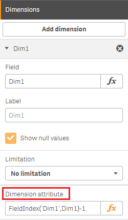

The result of the formula should be:

* an integer which can be used as an offset into the color scheme (specify color attribute: *offset*)

* a color which can be used directly (specify "Color attribute": *color value*).  This direct color value can be:

  * a number which is converted to hex #nnnnnn for the browser,

  * a text constant which can be understood by browsers: 'red', 'aqua', 'orange'

  * a text rgb string: 'rgb(128,128,128)'

### Which attribute do I use?  A measure attribute or a dimension attribute?

* 0 Dimensions, N Measures (simple bar graph) - specify a measure attribute

* 1 Dimension, 1 Measure (simple bar graph) - specify a dimension attribute

* 1 Dimension, N Measures (stacked bar graph) - specify a measure attribute

* 2 Dimensions, 1 Measure (stacked bar graph) - specify a dimension attribute for 2nd dimension

### Persistent Colors

When colors are assigned in the order that the data was received, you can have two charts where the colors for a particular dimension do not match.
One chart may assign the colors differently due to the structure of the data.
To prevent this from happening, you can use calculated colors to make sure there is always a single mapping of dimension to color.
There are many ways to do this, but one way is to use the formula:

    FieldIndex('dimName',dimName)-1

To specify a dimension attribute returning an offset.  This uses the field load order.

Another technique to associate dimensions with persistent colors is given by Henric Cronström.  See
https://community.qlik.com/blogs/qlikviewdesignblog/2012/12/04/colors-in-charts

* Matching Qlik Sense charts

Through some experiments, I was not able to determine how Qlik Sense uses persistent colors.
For a dimension with a large number of values, the mapping to a color scheme appears to be sequential.
However, if the dimension has only a few members, the mapping does not seem to follow a recognizable pattern.
You can still make barsPlus colors match Qlik Sense charts on the same sheet, but it may require trial and error in creating a formula.
If anyone is aware of the algorithm Qlik Sense uses to assign persistent colors, please let me know.

## Examples of color attribute formulas

Please also see the sheet "Colors Enhancement" in the Qlik Sense application **[BarsPlus.qvf](resources/BarsPlus.qvf)** in the app subfolder.

In a dimension attribute

    FieldIndex('dimName',dimName)-1
    Pick(FieldIndex('dimName',dimName),red(),blue(),green(),rgb(128,0,30))
    Pick(Match(Month,'Jan','Feb','Mar'),red(),blue(),green())
    Color(FieldIndex('dimName',dimName))
    If(dimName='My Company',red(),blue())

In a measure attribute can use measure aggregate in expressions, constants, or dimension expressions

    rgb(255*Sum(Measure1)/(Sum(Measure1)+Sum(Measure2)),0,0)

Following are examples for either dimension or measure attributes, (note string constants are evaluated by the browser, other formulas by the Qlik Sense engine).

    'red'
    'azure'
    'rgb(123,87,22)'
    '#d0d0d0'
    rgb(rand()*255,rand()*255,rand()*255)
    blue()

# Changing Defaults

If you would like to change any default settings, just make the appropriate change to **barsPlus-props.js**.

# Example Qlik Sense Application

See the Qlik Sense application **[BarsPlus.qvf](resources/BarsPlus.qvf)** in the **resources** folder for the examples shown on this page.

# Test Program

A standalone AngularJS application has been created to allow seeing the effect of various parameter changes quickly.  Just double-click on the file **barsPlus-test.html** in the extension folder.  This has test data sets and form elements to change parameters.  The buttons at the top will reduce the data set or resize the control.

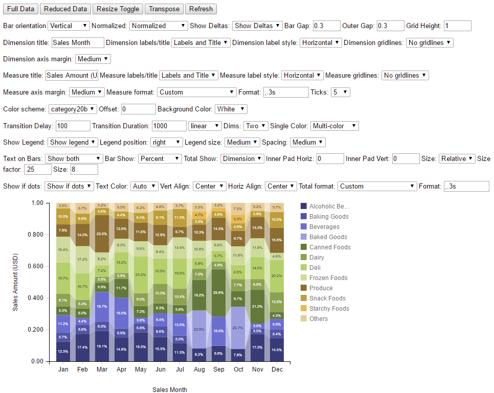

# Known Limitations

* No lasso in standard selections
* When selecting "elastic" or "back" transitions, there are console errors starting with: `Error: <rect> attribute height: A negative value is not valid.`

# Original author

[github.com/LarryWoodside](https://github.com/LarryWoodside)

# License

Released under the [MIT License](LICENSE).

The external library D3 is used within this solution:

**D3**
* License: BSD 3-Clause "New" or "Revised" License
* Url: http://d3js.org/
* Author: Michael Bostock